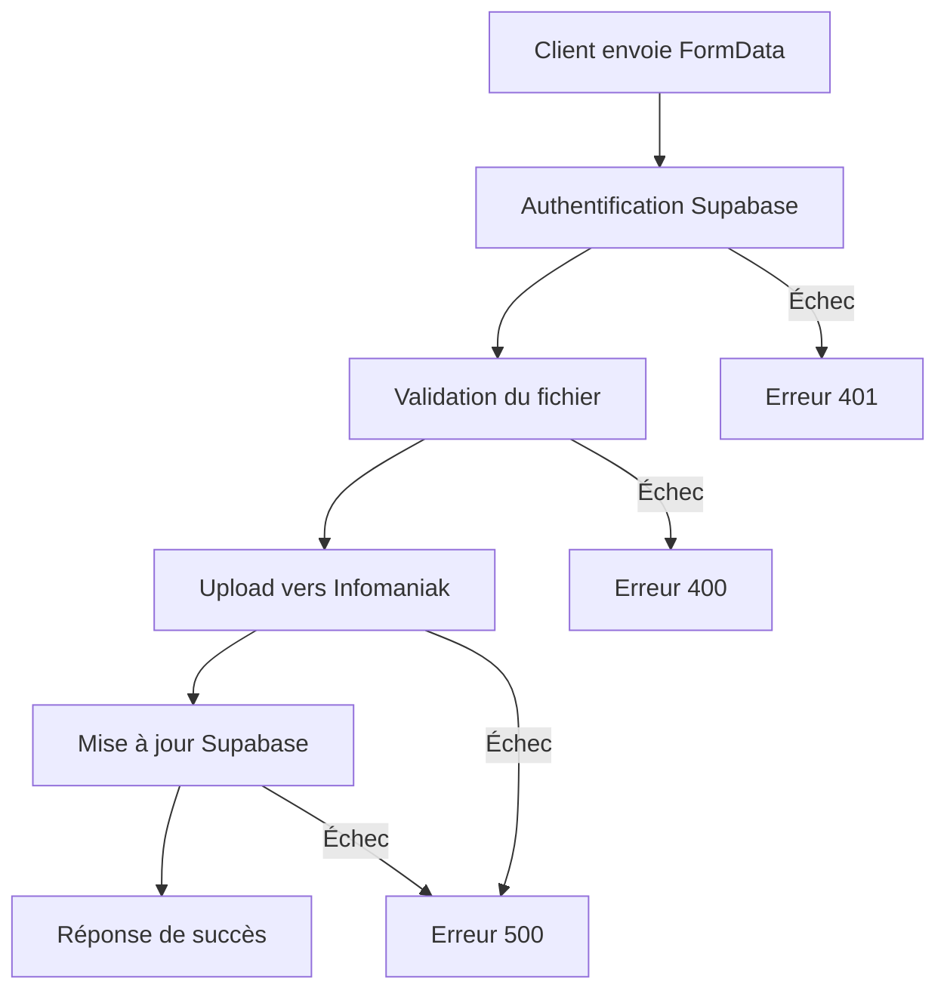

# 📁 API Upload - Documentation Complète

## 🎯 Vue d'ensemble

Endpoint moderne pour l'upload d'images de véhicules via l'API REST d'Infomaniak, compatible Next.js 15.

**URL :** `POST /api/upload`  
**Framework :** Next.js 15  
**Authentification :** Supabase (Bearer Token)  
**Stockage :** Infomaniak API REST + Supabase  

---

## 🔧 Configuration Technique

### Variables d'environnement requises

```env
# Supabase
NEXT_PUBLIC_SUPABASE_URL=your_supabase_url
NEXT_PUBLIC_SUPABASE_ANON_KEY=your_supabase_anon_key
SUPABASE_SERVICE_ROLE_KEY=your_service_role_key

# Infomaniak
INFOMANIAK_TOKEN=your_infomaniak_api_token
```

### Dépendances installées

```bash
npm install formidable@2 ssh2-sftp-client dotenv
```

### Dépendances supprimées (obsolètes)

```bash
npm uninstall readable-stream string_decoder concat-stream formidable
```

---

## 🚀 Utilisation de l'API

### Endpoint

```http
POST /api/upload
```

### Headers requis

```http
Authorization: Bearer <supabase_token>
Content-Type: multipart/form-data
```

### Body (FormData)

| Champ | Type | Requis | Description |
|-------|------|--------|-------------|
| `file` | File | ✅ | Fichier image à uploader |
| `ref_auto` | string | ✅ | Référence du véhicule (ex: AB12345) |
| `car_id` | number | ✅ | ID du véhicule dans la table cars_v2 |

### Exemple de requête

```javascript
const formData = new FormData();
formData.append('file', imageFile);
formData.append('ref_auto', 'AB12345');
formData.append('car_id', '123');

const response = await fetch('/api/upload', {
  method: 'POST',
  headers: {
    'Authorization': `Bearer ${supabaseToken}`
  },
  body: formData
});

const result = await response.json();
```

---

## 📋 Réponses de l'API

### Succès (200)

```json
{
  "success": true,
  "filePath": "https://www.mkbautomobile.com/uploads/AB12345/image-1.jpg",
  "message": "Image uploadée avec succès",
  "photoNumber": 1
}
```

### Erreur d'authentification (401)

```json
{
  "success": false,
  "error": "Token d'authentification manquant"
}
```

### Erreur de validation (400)

```json
{
  "success": false,
  "error": "Type de fichier non autorisé: application/pdf. Types autorisés: image/jpeg, image/jpg, image/png, image/webp, image/gif"
}
```

### Erreur serveur (500)

```json
{
  "success": false,
  "error": "Erreur lors de l'upload vers Infomaniak"
}
```

---

## 🛡️ Sécurité et Validation

### Types de fichiers autorisés

- **MIME Types :** `image/jpeg`, `image/jpg`, `image/png`, `image/webp`, `image/gif`
- **Extensions :** `.jpg`, `.jpeg`, `.png`, `.webp`, `.gif`
- **Taille maximale :** 10MB

### Validation automatique

1. **Authentification Supabase** : Vérification du token Bearer
2. **Type MIME** : Validation du type de fichier
3. **Extension** : Vérification de l'extension du fichier
4. **Taille** : Contrôle de la taille du fichier
5. **Données requises** : Vérification de la présence de tous les champs

---

## 📁 Gestion des fichiers

### Nommage automatique

Les fichiers sont renommés automatiquement selon le pattern :
```
image-{numero}.{extension}
```

Exemples :
- `image-1.jpg`
- `image-2.png`
- `image-3.webp`

### Structure des dossiers

```
/var/www/mkbautomobile/uploads/
└── {ref_auto}/
    ├── image-1.jpg
    ├── image-2.png
    └── image-3.webp
```

### URL publique

```
https://www.mkbautomobile.com/uploads/{ref_auto}/{filename}
```

---

## 🗄️ Intégration Supabase

### Table `advertisements`

L'endpoint met à jour automatiquement la table `advertisements` :

```sql
-- Structure de la table
CREATE TABLE advertisements (
  id SERIAL PRIMARY KEY,
  car_id INTEGER REFERENCES cars_v2(id),
  photos TEXT[] DEFAULT '{}',
  title TEXT,
  description TEXT,
  price DECIMAL(10,2),
  created_at TIMESTAMP DEFAULT NOW()
);
```

### Logique de mise à jour

1. **Récupération** : Vérifie si une annonce existe pour le `car_id`
2. **Création** : Crée une nouvelle annonce si elle n'existe pas
3. **Mise à jour** : Ajoute l'URL de la nouvelle photo au tableau `photos[]`
4. **Déduplication** : Évite les doublons dans le tableau

---

## 🔄 Workflow complet



---

## 🛠️ Corrections apportées au projet

### 1. Nettoyage des dépendances

```bash
# Suppression des dépendances obsolètes
npm uninstall readable-stream string_decoder concat-stream formidable

# Installation des dépendances modernes
npm install formidable@2 ssh2-sftp-client dotenv

# Nettoyage complet
rm -rf node_modules package-lock.json
npm install
```

### 2. Correction des erreurs de type

**Problème :** Props manquantes dans les composants `Form`

**Solution :** Remplacer `<Form {...form}>` par `<Form form={form}>`

**Fichiers corrigés :**
- `components/forms/ContactDrawer.tsx`
- `components/forms/VehicleDrawer.tsx`
- `app/dashboard/contacts/add/page.tsx`

### 3. Configuration Next.js

**Problème :** `output: 'export'` incompatible avec les API routes dynamiques

**Solution :** Retirer `output: 'export'` de `next.config.js`

```javascript
// Avant
const nextConfig = {
  output: 'export', // ❌ Incompatible avec API routes
  // ...
};

// Après
const nextConfig = {
  // ✅ Mode server activé pour API routes
  eslint: {
    ignoreDuringBuilds: true,
  },
  images: { unoptimized: true },
  experimental: {
    serverExternalPackages: [],
    optimizePackageImports: [
      'lucide-react',
      '@radix-ui/react-icons',
      'framer-motion',
      'recharts'
    ]
  }
};
```

---

## 🚀 Déploiement

### Prérequis

1. **Environnement server** : Vercel, Netlify Functions, ou serveur Node.js
2. **Variables d'environnement** : Configurées sur la plateforme de déploiement
3. **Mode server** : `output: 'export'` retiré de la configuration

### Vercel (recommandé)

```bash
# Installation de Vercel CLI
npm i -g vercel

# Déploiement
vercel --prod
```

### Variables d'environnement Vercel

```bash
# Dans l'interface Vercel
NEXT_PUBLIC_SUPABASE_URL=your_supabase_url
NEXT_PUBLIC_SUPABASE_ANON_KEY=your_supabase_anon_key
SUPABASE_SERVICE_ROLE_KEY=your_service_role_key
INFOMANIAK_TOKEN=your_infomaniak_api_token
```

---

## 🧪 Tests

### Test de l'endpoint

```bash
# Test avec curl
curl -X POST \
  -H "Authorization: Bearer YOUR_SUPABASE_TOKEN" \
  -F "file=@test-image.jpg" \
  -F "ref_auto=TEST123" \
  -F "car_id=1" \
  http://localhost:3000/api/upload
```

### Validation du build

```bash
npm run build
```

**Résultat attendu :**
```
✓ Compiled successfully
✓ Checking validity of types
✓ Collecting page data
✓ Generating static pages
✓ Finalizing page optimization
```

---

## 📝 Notes importantes

### Limitations

- **Taille de fichier** : Maximum 10MB par image
- **Types supportés** : Images uniquement (JPG, PNG, WEBP, GIF)
- **Authentification** : Token Supabase requis
- **Déploiement** : Nécessite un environnement server (pas de static export)

### Bonnes pratiques

1. **Validation côté client** : Vérifiez le type et la taille avant l'envoi
2. **Gestion d'erreurs** : Implémentez une logique de retry en cas d'échec
3. **Feedback utilisateur** : Affichez le progrès de l'upload
4. **Sécurité** : Ne stockez jamais de tokens sensibles côté client

### Maintenance

- **Monitoring** : Surveillez les logs d'erreur
- **Backup** : Sauvegardez régulièrement les données Supabase
- **Mise à jour** : Maintenez les dépendances à jour
- **Tests** : Testez régulièrement l'endpoint

---

## 🔗 Liens utiles

- [Documentation Next.js 15](https://nextjs.org/docs)
- [API Supabase](https://supabase.com/docs/reference/javascript)
- [Infomaniak API](https://api.infomaniak.com/)
- [FormData API](https://developer.mozilla.org/en-US/docs/Web/API/FormData)

---

*Dernière mise à jour : $(date)* 